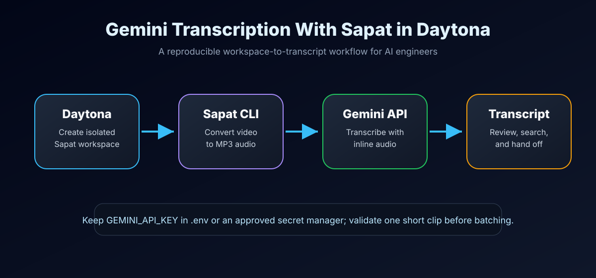

# Run Gemini Transcription With Sapat in Daytona

# Introduction

Audio and video transcription is now a normal part of AI engineering work. Product demos,
research interviews, incident calls, customer feedback, and internal walkthroughs all become
more useful after they are converted into searchable text. The hard part is not only sending a
recording to a model. The hard part is creating a repeatable workflow that another engineer can
run with the same dependencies, the same command-line flags, and the same secret-handling rules.

This guide shows how to run [Sapat](https://github.com/nibzard/sapat), a Python video
transcription tool, inside a Daytona workspace and route transcription through Google Gemini.
The companion Sapat implementation adds `--api gemini` with the Gemini Developer API, so AI
engineers can test a multimodal transcription path next to the existing OpenAI, Groq, and Azure
providers. You will create a Daytona workspace, configure `GEMINI_API_KEY`, run a single-file
transcription, validate the output, and troubleshoot the most common failure modes.

## TL;DR

- **Use Daytona for reproducibility**: Run Sapat in a clean workspace with the same Python,
  `ffmpeg`, and package setup each time.
- **Use Gemini as another provider**: The companion Sapat PR adds `sapat --api gemini` without
  adding a new runtime dependency.
- **Keep secrets out of Git**: Store `GEMINI_API_KEY` in `.env` for local tests or in your
  team's approved secret manager, never in commits or article examples.
- **Validate before batching**: Start with one short recording, inspect the `.txt` output, then
  process a directory when the prompt and quality settings are stable.

## What You Will Build

The workflow has five moving parts:



1. Daytona creates an isolated workspace from the Sapat repository.
2. Sapat receives a video file or a directory of `.mp4` files.
3. Sapat uses `ffmpeg` to convert each recording to an MP3 sidecar.
4. The Gemini provider sends inline audio to the Gemini `generateContent` endpoint.
5. Sapat writes the transcript to a `.txt` file beside the original recording.

The companion implementation is in
[`nibzard/sapat#35`](https://github.com/nibzard/sapat/pull/35). Until that PR is merged, use the
feature branch from `xhh678876/sapat` for the hands-on steps below.

## Prerequisites

You need the following before starting:

- A GitHub account connected to Daytona.
- [Daytona](https://www.daytona.io/docs/installation/installation/) installed locally.
- Docker available on the machine that runs Daytona.
- A Gemini API key from [Google AI Studio](https://aistudio.google.com/app/apikey).
- A short `.mp4`, `.mp3`, `.wav`, or `.flac` recording for the first smoke test.
- Basic familiarity with [APIs](../definitions/20241212_definition_api.md), Python, and terminal
  commands.

Gemini inline audio requests have a request-size ceiling. The Sapat Gemini provider uses a
conservative raw file limit of 14 MB because base64 encoding expands audio by roughly one third.
For long meetings, split the recording first or use a provider flow that supports uploaded files.

## Step 1: Create a Daytona Workspace for Sapat

Start Daytona if it is not already running:

```bash
daytona server
```

Create a workspace from the fork that contains the Gemini provider branch:

```bash
daytona create https://github.com/xhh678876/sapat --code
```

When the workspace opens, switch to the Gemini branch:

```bash
git checkout feat/gemini-transcription-provider
```

If the companion PR has already been merged by the time you read this, use the upstream
repository instead:

```bash
daytona create https://github.com/nibzard/sapat --code
```

Daytona gives you a clean environment, but it does not remove the need to verify the basics.
Confirm that you are in the Sapat project root:

```bash
pwd
git status --short
```

## Step 2: Install Sapat in Editable Mode

Create a virtual environment and install the package:

```bash
python -m venv .venv
source .venv/bin/activate
python -m pip install --upgrade pip
python -m pip install -e .
```

Confirm the CLI exposes the Gemini provider:

```bash
sapat --help
```

You should see `gemini` listed in the `--api` option beside `openai`, `groq`, and `azure`.

Sapat depends on `ffmpeg` for video-to-audio conversion. The repository dev container installs it,
but you can verify it directly:

```bash
ffmpeg -version
```

If the command is missing inside the workspace, install it with your package manager. On Debian or
Ubuntu based images:

```bash
sudo apt update
sudo apt install -y ffmpeg
```

## Step 3: Configure Gemini Without Committing Secrets

Copy the example environment file:

```bash
cp .env.example .env
```

Open `.env` and add the Gemini values:

```bash
GEMINI_API_KEY=your_gemini_api_key_here
GEMINI_MODEL=gemini-2.0-flash
GEMINI_API_ENDPOINT_TEMPLATE=https://generativelanguage.googleapis.com/v1beta/models/{model}:generateContent
```

The only required value is `GEMINI_API_KEY`. `GEMINI_MODEL` defaults to `gemini-2.0-flash`, and the
endpoint template defaults to the Gemini Developer API `generateContent` route.

Before you continue, check that `.env` is not staged:

```bash
git status --short
```

If you see `.env` in the output, stop and add it to your local ignore rules before committing any
work. API keys should stay in the workspace, not in Git.

## Step 4: Understand How the Gemini Provider Works

The provider keeps Sapat's existing shape. You still run the same `sapat` command, choose a
provider with `--api`, and receive a `.txt` transcript next to the input file.

Under the hood, the Gemini provider does four things:

1. Validates that the converted audio file exists and uses `.mp3`, `.wav`, or `.flac`.
2. Rejects raw files above 14 MB to stay under Gemini inline request limits after base64 encoding.
3. Builds a Gemini prompt from the `--language` hint and optional `--prompt` guidance.
4. Sends JSON to `generateContent` with the audio in an `inline_data` part.

That last point is different from OpenAI-style Whisper endpoints. With Whisper-compatible APIs,
Sapat sends a multipart form upload. With Gemini, Sapat sends a JSON request containing both text
instructions and base64-encoded audio.

## Step 5: Run a Single-File Transcription

Start with a short file. Put it in a folder named `recordings`:

```bash
mkdir -p recordings
# Copy your test file into recordings/demo.mp4, or use your own filename.
```

Run Sapat with Gemini:

```bash
sapat recordings/demo.mp4 \
  --api gemini \
  --quality M \
  --language en \
  --prompt "Product names: Daytona, Sapat, Gemini. Keep technical terms exact."
```

Sapat will print progress messages similar to this:

```text
Processing recordings/demo.mp4
Conversion to MP3 completed
Transcription completed
Transcription saved to recordings/demo.txt
```

Open the transcript:

```bash
sed -n '1,120p' recordings/demo.txt
```

Check three things before moving on:

- The transcript is present and not empty.
- Product names such as Daytona, Sapat, and Gemini are spelled correctly.
- The transcript does not include model commentary like "Here is the transcription".

The Gemini prompt asks the model to return only transcript text. If you still see wrapper text,
make the user prompt stricter and run the same short file again.

## Step 6: Use Prompt Hints for Engineering Recordings

Transcription quality often depends on context. Engineering recordings contain repository names,
API names, incident IDs, and acronyms that are easy to mishear. Sapat exposes `--prompt` so you can
pass those hints without editing the source code.

For a bug reproduction video:

```bash
sapat recordings/bug-repro.mp4 \
  --api gemini \
  --language en \
  --prompt "Terms: Daytona workspace, devcontainer, GEMINI_API_KEY, generateContent, ffmpeg. Preserve CLI flags exactly."
```

For a research interview:

```bash
sapat recordings/interview.mp4 \
  --api gemini \
  --language en \
  --prompt "This is an AI engineering interview. Preserve model names, dataset names, and benchmark names exactly."
```

For a multilingual clip, set the language hint to the dominant language and add context in the
prompt:

```bash
sapat recordings/mixed-language-demo.mp4 \
  --api gemini \
  --language zh \
  --prompt "The recording mixes Chinese and English. Preserve English API names exactly."
```

Do not put private customer details in the prompt unless your data policy allows it. The prompt is
sent to the transcription provider along with the audio.

## Step 7: Run the Optional Correction Pass

The companion provider also supports Sapat's `--correct` flag. This performs a second Gemini call
that asks for light cleanup after transcription.

```bash
sapat recordings/demo.mp4 \
  --api gemini \
  --quality M \
  --language en \
  --prompt "Product names: Daytona, Sapat, Gemini." \
  --correct
```

Use `--correct` when you need cleaner punctuation or capitalization. Skip it when you need a more
literal transcript for legal, research, or audit workflows because the cleanup pass can smooth over
small hesitations or repeated words.

## Step 8: Process a Directory

After one short file succeeds, process a batch directory:

```bash
sapat recordings \
  --api gemini \
  --quality M \
  --language en \
  --prompt "Engineering demo recordings. Preserve CLI commands and environment variable names."
```

Sapat processes `.mp4` files in the directory and writes one `.txt` file per recording. Keep the
first batch small. A good pattern is:

1. Run one file.
2. Review the transcript.
3. Adjust `--prompt` and `--quality`.
4. Run three to five files.
5. Only then run the full folder.

This protects your API budget and makes quality problems visible before they affect a whole batch.

## Step 9: Validate the Provider Without Spending API Credits

The companion Sapat PR includes mocked unit tests. They validate request construction and error
handling without sending audio to Gemini:

```bash
python -m unittest discover -s tests -v
python -m compileall src tests
git diff --check
```

The tests cover:

- Inline base64 audio construction.
- `GEMINI_API_KEY` validation.
- Gemini response parsing.
- Request failures and non-JSON responses.
- Safety or prompt-feedback blocks.
- Custom endpoint templates.
- CLI routing for `--api gemini`.

Run these checks before changing the provider. They are faster than a real transcription call and
safe to run in CI.

## Common Issues and Troubleshooting

**Problem: `GEMINI_API_KEY is required`.**

**Solution:** Add `GEMINI_API_KEY` to `.env`, restart the shell if needed, and run the command from
the Sapat project root so `python-dotenv` can load the file.

**Problem: The request fails because the file is too large.**

**Solution:** Use a shorter clip, lower the MP3 quality with `--quality L`, or split the recording
before running Sapat. The Gemini provider intentionally keeps raw files below 14 MB to stay under
inline request limits after base64 encoding.

**Problem: `ffmpeg` is not found.**

**Solution:** Install `ffmpeg` in the workspace. For Debian or Ubuntu images, run
`sudo apt install -y ffmpeg`. Then retry the Sapat command.

**Problem: The transcript is empty or Gemini returns no candidates.**

**Solution:** Check whether the audio is silent, too short, or blocked by provider safety feedback.
Try a known-good short clip and simplify the prompt. If the error includes prompt feedback, remove
sensitive or policy-triggering instructions and rerun.

**Problem: Technical names are misspelled.**

**Solution:** Add a compact glossary to `--prompt`. Put product names, repository names, CLI flags,
and unusual acronyms in the prompt before the first run.

**Problem: The transcript includes extra narration from the model.**

**Solution:** Strengthen the prompt with "Return only the transcript text" and rerun a short sample.
The provider already includes that instruction, but extra user context can sometimes distract a
multimodal model.

## Conclusion

You now have a reproducible AI transcription workflow that runs Sapat inside Daytona and uses
Google Gemini as a provider. The important part is not just the API call. The important part is the
repeatable loop: create the workspace, configure secrets safely, transcribe one short file, review
the output, tune the prompt, and only then batch-process a folder.

Gemini is a useful addition because it gives Sapat another multimodal model path without changing
the CLI workflow. If you later compare providers, keep the input file, language hint, prompt, and
quality setting constant. That makes the transcript differences easier to attribute to the provider
instead of the environment.

## References

- [Sapat repository](https://github.com/nibzard/sapat)
- [Companion Gemini provider PR](https://github.com/nibzard/sapat/pull/35)
- [Daytona installation documentation](https://www.daytona.io/docs/installation/installation/)
- [Google AI Studio API keys](https://aistudio.google.com/app/apikey)
- [Gemini audio transcription definition](../definitions/20260521_definition_gemini_audio_transcription.md)
